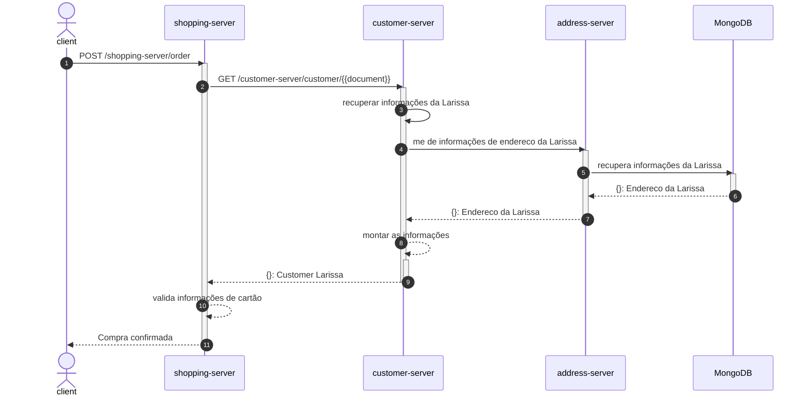

# spring-kafka


## USE CASE: New Order


### 1 - New Order

````shell
curl --location --request POST 'locahost:8080/shopping-server/order' \
--header 'Content-Type: application/json' \
--data-raw '{
    "document": "123121231",
    "card" : {
        "number": "1234XXXXX1234",
        "token":  "12312SCAS!23123",
        "Bandeira":  "Mastercard"
    },
    "address": {
        "default": true
    }
}'
````

### 2 - Get Customer info by Document
````shell
curl --location -g --request GET 'locahost:8080/customer-server/customer/{{document}}'
````